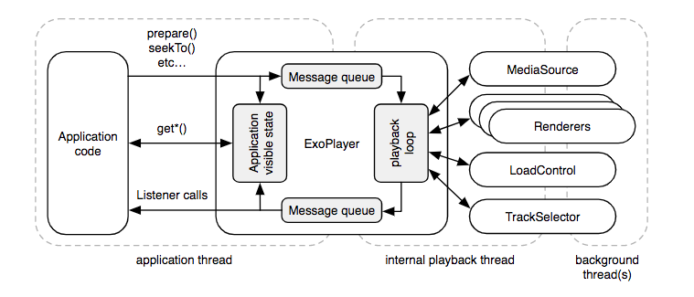

# GifList
MVVM - LiveData

mp3 service implementation with binding & orintation change

volley network

notification 

ExoPlayer - jump to desire track position

orientaion change handling (without unnecessary network operation)

GC friendly - tested with "com.squareup.leakcanary"
